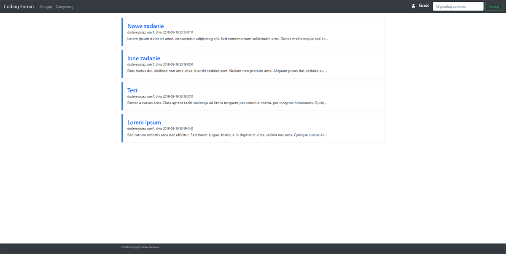
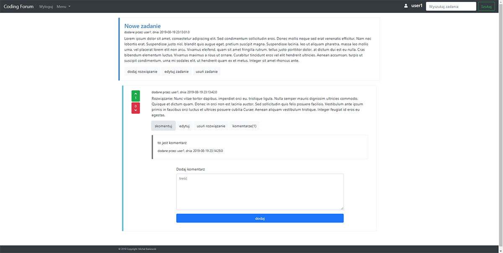

# Coding Forum app
> Simple Java EE Web application 

## Table of contents
* [General info](#general-info)
* [Screenshots](#screenshots)
* [Technologies](#technologies)
* [Features](#features)
* [Status](#status)

## General info
Simple forum web application. This is expanded version of Java EE workshop from CodersLab course.
There are 3 basic model objects:
* exercise - object created by user to describe problem to be solved
* solution - user can propose his/her solution to exercise problem
* comment on solutions

## Screenshots
>landing page

>exercise detail

## Technologies
* Java EE 
  - servlet-api - version - 4.0.1
  - jstl - version - 1.2
* Data Base - MySql - version 8.0.13
* Tomcat 9.0.14
* Bootstrap 4

## Features
* Unlogged user has readonly access to:
  - list of exercises
  - exercise details with all solutions and comments
* Logged user 
  - also has access to:
    - his/her exercise list, solution list, comments list
  - can:
    - add / edit / delete exercise, solution, comment
    - can like or dislike someones solution
* other features:
  - sending email with activation account link

* Design pattern used:
  - Data Access Object
  - Abstract Factory
  - Singleton  
## Status
Project is: finished